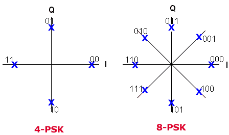
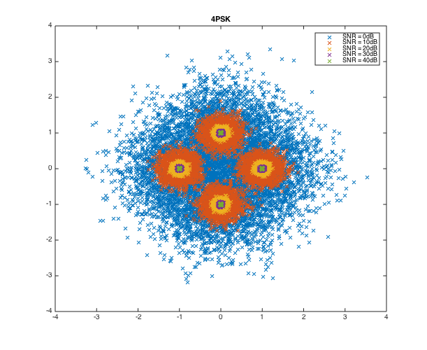

% 信道编码
% 无36
  李思涵
  2013011187
  <lisihan969@gmail.com>
% \today

#
## 模块设计

### 电平映射

根据效率选取映射方式，将信号映射到复电平

### 模拟信道

模拟 AWGN 信道，按照给定的信噪比加噪声

```matlab
function noised_signal = transmit(signal, snr)
    noised_signal = awgn(signal, snr, 'measured');
end
```

## p9 `crc_encode`

选取多项式为 CRC12

x^12 + x^11 + x^3 + x^2 + x + 1

首先在序列的末尾填 0，直到序列长度变为帧长度的整数倍。

然后对每个帧补零后，用该多项式对每个帧进行模 2 除，将余数添加在该帧后作为校验和。

```matlab
function crced_symbols = crc_encode(symbols, crc_poly, frame_size)
    frames = ceil(length(symbols) / frame_size);
    pad = frames * frame_size - length(symbols);
    symbols = [symbols; zeros(pad, 1)];

    symbols = reshape(symbols, frame_size, frames);
    crced_symbols = padarray(symbols, [length(crc_poly) - 1, 0], 'post');

    for col = 1:frames
        for row = 1:frame_size
            if crced_symbols(row, col)
                crced_symbols(row:row+length(crc_poly)-1, col) = ...
                    xor(crced_symbols(row:row+length(crc_poly)-1, col), ...
                        crc_poly);
            end
        end
    end
    crced_symbols(1:frame_size, :) = symbols;
    crced_symbols = crced_symbols(:);
end
```

## p11 `sym_encode`

为了方便软解码，1/2 效率使用 4PSK，1/8 效率使用 8PSK。



## p12  `transmit`

使用 AWGN 信道，对复电平序列以一定的信噪比加上高斯白噪声。

其中实部和虚部的噪声为独立同分布的高斯分布。

## p15 `crc_decode`

先根据给定帧长，将符号序列的各个帧分割开来。

对每个帧用相同的多项式（CRC12）进行校验。

校验方法为，使用该多项式对帧进行模2除。若能被整除，则认为该帧传输正常，否则则认为该块错误。

```matlab
function [symbols, err_rate] = crc_decode(crced_symbols, crc_poly, frame_size)
    crced_frame_size = frame_size + (length(crc_poly) - 1);
    frames = floor(length(crced_symbols) / crced_frame_size);
    crced_symbols = reshape(crced_symbols(1:frames*crced_frame_size), ...
                            crced_frame_size, frames);

    symbols = crced_symbols(1:frame_size, :);
    symbols = symbols(:);

    err = 0;
    for col = 1:frames
        for row = 1:frame_size
            if crced_symbols(row, col)
                crced_symbols(row:row+length(crc_poly)-1, col) = ...
                    xor(crced_symbols(row:row+length(crc_poly)-1, col), ...
                        crc_poly);
            end
        end
        if any(crced_symbols(frame_size+1:end, col))
            err = err + 1
        end
    end

    err_rate = err / frames;
end
```

## 复基带星座图

我们直接使用 `plot` 函数，分别画出了 SNR 为 0dB, 10dB, 20dB, 30dB, 40dB 时的星座图。




# 单元测试

使用 Communications System Toolbox 中的 `poly2trellis`（描述卷积码）， `convenc`（卷机码编码）， `vitdec`（维特比解码），对编解码进行了单元测试。

## `test_conv_encode.m`

测试卷积码编码。

```matlab
symbols = randi([0 1], 1000, 1);
trellis_2 = poly2trellis(4, [15, 17]);      % 1/2.
trellis_3 = poly2trellis(4, [13, 15, 17]);  % 1/3.

assert_encode = @(real_code, expected_code, description) ...
    assert(all(size(real_code) == size(expected_code)) && ...
           all(real_code == expected_code), ...
           ['Assertion failed: ' description '\n' ...
            'Symbols: %s\n' ...
            'Expected: %s\n' ...
            'Real:     %s\n'], ...
           mat2str(symbols), mat2str(expected_code), mat2str(real_code));

% No ending, no CRC.
assert_encode(conv_encode(symbols, false, 2, []), ...
              convenc(symbols, trellis_2), ...
              'conv_encode, 1/2, no ending, no CRC');
assert_encode(conv_encode(symbols, false, 3, []), ...
              convenc(symbols, trellis_3), ...
              'conv_encode, 1/3, no ending, no CRC');

% With ending, no CRC.
symbols_with_ending = [symbols; zeros(3, 1)];
assert_encode(conv_encode(symbols, true, 2, []), ...
              convenc(symbols_with_ending, trellis_2), ...
              'conv_encode, 1/2, with ending, no CRC');
assert_encode(conv_encode(symbols, true, 3, []), ...
              convenc(symbols_with_ending, trellis_3), ...
              'conv_encode, 1/3, with ending, no CRC');
```

## `test_conv_decode.m`

测试卷积码译码。

```matlab
LEN = 10;
symbols = randi([0 1], LEN, 1);
trellis_2 = poly2trellis(4, [15, 17]);      % 1/2.
trellis_3 = poly2trellis(4, [13, 15, 17]);  % 1/3.
PSNR = -10;

assert_decode = @(signal, real_symbols, expected_symbols, description) ...
    assert(all(size(real_symbols) == size(expected_symbols)) && ...
           all(real_symbols == expected_symbols), ...
           ['Assertion failed: ' description '\n' ...
            'Signal: %s\n' ...
            'Expected: %s\n' ...
            'Real:     %s\n'], ...
           mat2str(signal), mat2str(expected_symbols), mat2str(real_symbols));

% No ending, no CRC, hard.
signal_2 = transmit(sym_encode(convenc(symbols, trellis_2), 2), PSNR);
signal_3 = transmit(sym_encode(convenc(symbols, trellis_3), 3), PSNR);
code2 = sym_decode(signal_2, 2);
code3 = sym_decode(signal_3, 3);

assert_decode(signal_2, ...
              conv_decode(signal_2, false, 2, [], true), ...
              vitdec(code2, trellis_2, LEN, 'trunc', 'hard'), ...
              'conv_decode, 1/2, no ending, no CRC, hard');
assert_decode(signal_3, ...
              conv_decode(signal_3, false, 3, [], true), ...
              vitdec(code3, trellis_3, LEN, 'trunc', 'hard'), ...
              'conv_decode, 1/3, no ending, no CRC, hard');

% With ending, no CRC, hard.
symbols_with_ending = [symbols; zeros(3, 1)];
signal_2 = transmit(sym_encode(convenc(symbols_with_ending, trellis_2), 2), PSNR);
signal_3 = transmit(sym_encode(convenc(symbols_with_ending, trellis_3), 3), PSNR);
code2 = sym_decode(signal_2, 2);
code3 = sym_decode(signal_3, 3);

expected = vitdec(code2, trellis_2, LEN + 3, 'term', 'hard');
expected = expected(1:end-3);
assert_decode(signal_2, ...
              conv_decode(signal_2, true, 2, [], true), ...
              expected, ...
              'conv_decode, 1/2, with ending, no CRC, hard');

expected = vitdec(code3, trellis_3, LEN + 3, 'term', 'hard');
expected = expected(1:end-3);
assert_decode(signal_3, ...
              conv_decode(signal_3, true, 3, [], true), ...
              expected, ...
              'conv_decode, 1/3, with ending, no CRC, hard');
```
